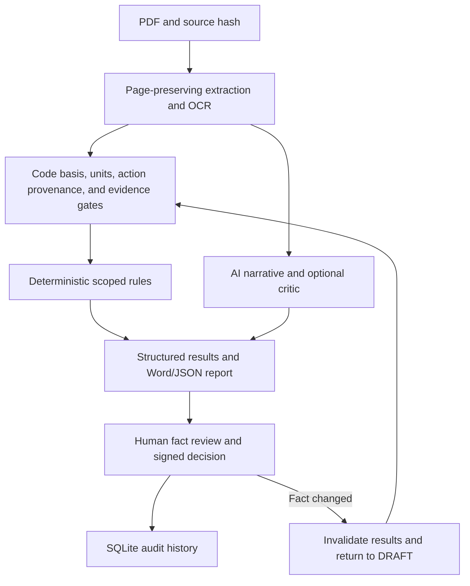

# IDC v0.17 Architecture

## System Layers

1. **Ingestion** computes the source SHA-256 and preserves page boundaries, extraction method, OCR diagnostics, images, warnings, and coverage.
2. **Evidence and design-basis gates** reject missing, conflicting, unitless, or unreferenced required facts before capacity checks.
3. **Code-basis resolver** preserves standards declared in the report, detects mixed HK/BS/EN/GB bases, and requires reviewer pinning where member-code applicability is ambiguous. The general HK profile is context, not a Concrete Code fallback.
4. **Submission normalizer** classifies cover, contents, calculation, drawing, supporting and unknown pages. Calculation review uses calculation/supporting/uncertain candidates; drawings are recorded and deferred in v0.17.
5. **Reference validator** checks model-suggested clauses against the text-only local Concrete, Foundation and Steel indexes. A report declaration is required before a local code family can support a comment.
4. **Deterministic adapters** produce traceable `CheckResult` objects only for a matched code basis and supported fact type. The first v0.17 adapter is deliberately narrow and remains below the general review UI.
5. **AI narrative** reviews omissions and constructability. The optional critic is a second observation pass; neither AI path can create or override engineering `PASS`/`FAIL`.
6. **Persistence and review** store runs, facts, results, edits, decisions, and audit events in SQLite.
9. **Delivery adapters** preserve CLI, OCR CLI, GUIs, Flask server, Word/JSON reports, QA batch mode, Docker, and four executable entrypoints. Server jobs also provide a standard calculation package ZIP.

## Public Contracts

`SourceEvidence`, `CodeBasis`, `ExtractedFact`, `CheckResult`, `ReviewRun`, and `AuditEvent` are defined in `idc.models`. Check statuses are `PASS`, `FAIL`, `INSUFFICIENT_EVIDENCE`, `CONFLICT`, `OUT_OF_SCOPE`, `NOT_APPLICABLE`, and `ERROR`. Review statuses are `DRAFT`, `READY_FOR_REVIEW`, `APPROVED`, and `REJECTED`.

## Page Coverage

Long documents are split on page-aware boundaries. Oversized pages are explicitly split but retain the original page number. A report records processed and unprocessed pages; silent `content[:safe_len]` truncation is not used by the document-review path.

Chunking is an input transport detail only. Structured comments are parsed, code-validated and deduplicated before one human report is generated; chunk headings and raw model reports are not exposed in the Word deliverable.

## Data Locations

- Code-pack metadata: repository `codepacks/`
- Official PDFs: external `IDC_CODE_LIBRARY`
- Custom validated packs: `IDC_CODE_PACK_PATH`
- SQLite audit data: `IDC_DATA_DIR`
- Raw uploads/reports: configured server directories, subject to retention cleanup

## Extension Route

New jurisdictions provide a unique manifest and rule file. A loader validates the pack ID, jurisdiction, dates, hashes, and declared rule IDs. Detection alone never substitutes a rule pack. A reviewer-pinned non-HK pack must load successfully or the run stops; it never substitutes an HK pack.
