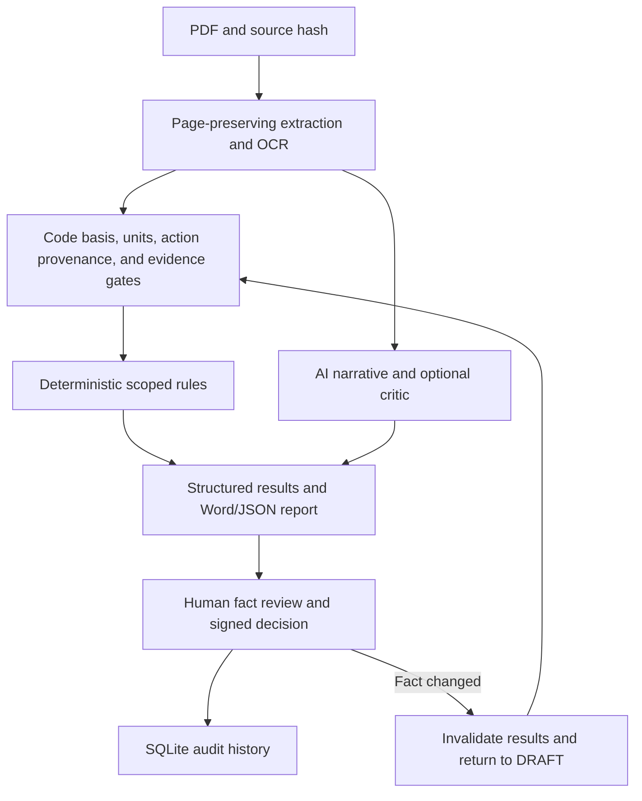

# IDC v0.17 Architecture

## System Layers

1. **Ingestion** computes the source SHA-256 and preserves page boundaries, extraction method, OCR diagnostics, images, warnings, and coverage.
2. **Evidence and design-basis gates** reject missing, conflicting, unitless, or unreferenced required facts before capacity checks.
3. **Code-pack registry** loads exactly the selected jurisdiction and version. Hong Kong is the default, not a fallback.
4. **Deterministic rules** produce traceable `CheckResult` objects. The v0.17 engine is limited to the declared RC beam scope.
5. **AI narrative** reviews omissions and constructability. The optional critic is a second observation pass; neither AI path can create or override engineering `PASS`/`FAIL`.
6. **Persistence and review** store runs, facts, results, edits, decisions, and audit events in SQLite.
7. **Delivery adapters** preserve CLI, OCR CLI, GUIs, Flask server, Word/JSON reports, QA batch mode, Docker, and four executable entrypoints.

## Public Contracts

`SourceEvidence`, `CodeBasis`, `ExtractedFact`, `CheckResult`, `ReviewRun`, and `AuditEvent` are defined in `idc.models`. Check statuses are `PASS`, `FAIL`, `INSUFFICIENT_EVIDENCE`, `CONFLICT`, `OUT_OF_SCOPE`, `NOT_APPLICABLE`, and `ERROR`. Review statuses are `DRAFT`, `READY_FOR_REVIEW`, `APPROVED`, and `REJECTED`.

## Page Coverage

Long documents are split on page-aware boundaries. Oversized pages are explicitly split but retain the original page number. A report records processed and unprocessed pages; silent `content[:safe_len]` truncation is not used by the document-review path.

## Data Locations

- Code-pack metadata: repository `codepacks/`
- Official PDFs: external `IDC_CODE_LIBRARY`
- Custom validated packs: `IDC_CODE_PACK_PATH`
- SQLite audit data: `IDC_DATA_DIR`
- Raw uploads/reports: configured server directories, subject to retention cleanup

## Extension Route

New jurisdictions provide a unique manifest and rule file. A loader validates the pack ID, jurisdiction, dates, hashes, and declared rule IDs. A selected non-HK pack must load successfully or the run stops; it never substitutes the HK pack.
