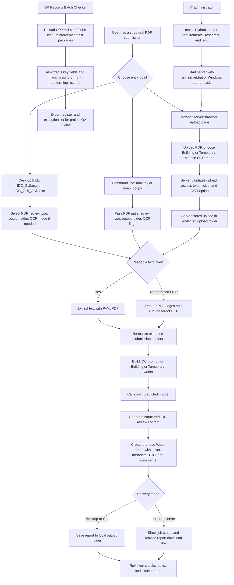

# IDC Workflow

This workflow shows how IDC is used today across desktop EXE, command line, and intranet server modes. The same review engine is reused where possible so report quality stays consistent across entry points.

## Current Operating Modes

- Desktop EXE mode remains the fastest path for personal testing and one-off local reviews.
- OCR EXE mode is used when PDFs are scanned or image-heavy.
- Intranet server mode lets staff upload from a browser while OCR and report generation run on the company server.
- CLI mode remains useful for repeatable testing and batch scripts.
- QA Records Batch Checker mode is used for batch registration of OP records, mill certificates, concrete cube tests, reinforcement tests, and similar QA records.

## Recommended Team Workflow

1. Staff or reviewer receives a PDF submission.
2. If working individually, use the desktop EXE.
3. If staff should avoid local installation, use the intranet server.
4. IDC extracts text or OCR content, calls the configured model, and generates a Word report.
5. A qualified reviewer checks the report, edits wording or findings where needed, and issues it through the normal project approval process.
6. IT maintains server configuration, API keys, Tesseract installation, access control, and retention of uploaded documents.

## QA Records Batch Workflow

1. Staff collects OP records, mill certificates, concrete cube tests, reinforcement tests, or a ZIP package of PDFs.
2. Staff opens the server `QA Records Batch Checker` page.
3. The server extracts PDF text or OCR content.
4. AI classifies each record and extracts register fields.
5. The server exports:
   - `qa_register.csv`
   - `qa_exceptions.csv`
   - `qa_raw_results.json`
   - `qa_summary.txt`
6. A QA/QC reviewer checks the register and exceptions before project acceptance.
